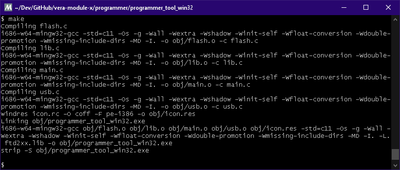

# Win32 VERA programming utility

Converted by [Xark](https://hackaday.io/Xark) from the original by Frank van den Hoef

This is a conversion of VERA programer_tool that uses a FTDI 232R, 232H or 2232H module to directly program the X16 VERA firmware (in SPI flash).

This was created to hopefully make it easier for Windows users to program the Commander X-16 VERA module firmware (if needed).  Also, being able to do this from Windows with (hopefully) fewer driver hassles than libUSB and using common inexpensive FTDI USB UART modules.  It may however not be as speedy as other solutions...

## Tools Required for Building under Windows

Install 64-bit [MSYS2 Platform](https://www.msys2.org/wiki/MSYS2-installation/).

Start MSYS2 and from the prompt update it with repeated `pacman -Syuu` commands until nothing more is updated (may require restarting MSYS2).

```sh
pacman -Syuu     # repeat until nothing updates
```

From the `MSYS2-mingw32` prompt (see the MSYS2 Start memu) issue the following commands to install the required build tools:

```sh
pacman -S make
pacman -S mingw-w64-i686-toolchain
```

Then `cd` into the project `programer/programmer-tool-win32` directory and type `make` and it should build the EXE file (in `out` folder).



You may need to install the [FTDI D2XX drivers](https://ftdichip.com/drivers/d2xx-drivers/).  You may possibly also need to copy the `ftd2xx.dll` file into the same folder as the executable, if it complains about a missing DLL (until a proper installer is created).
